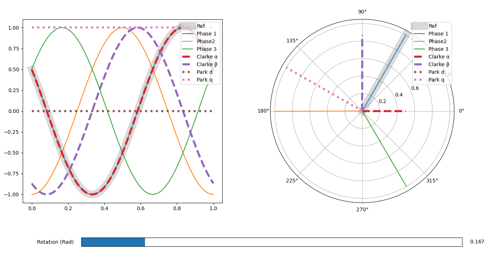

# Introduction #

I'm Exploring Clarke and Park motor control algorithms with interactive scripts. Maybe someone else will find them useful.

## Usage ##

This repository is meant to hold example code for interacting with these equations for demo and educational purposes only. Assuming you have python 3 installed, and the numpy and matplotlib packages installed in your python environment you should be able to run them.


For example, run:

```bash
python clarke_park.py
```
