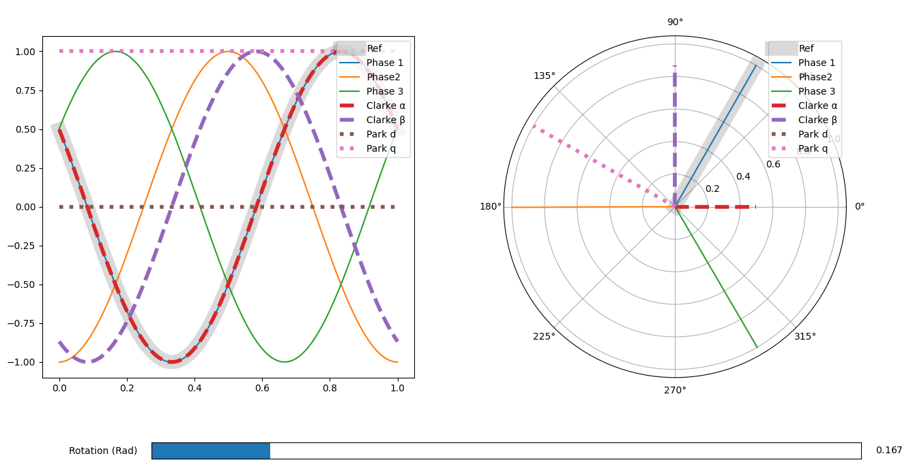
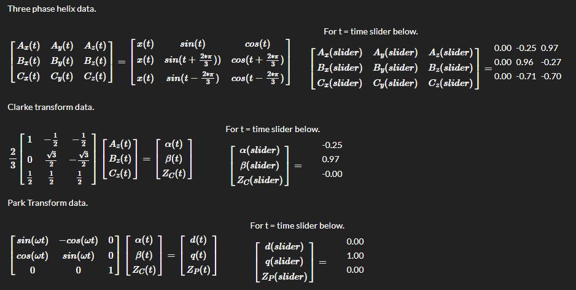
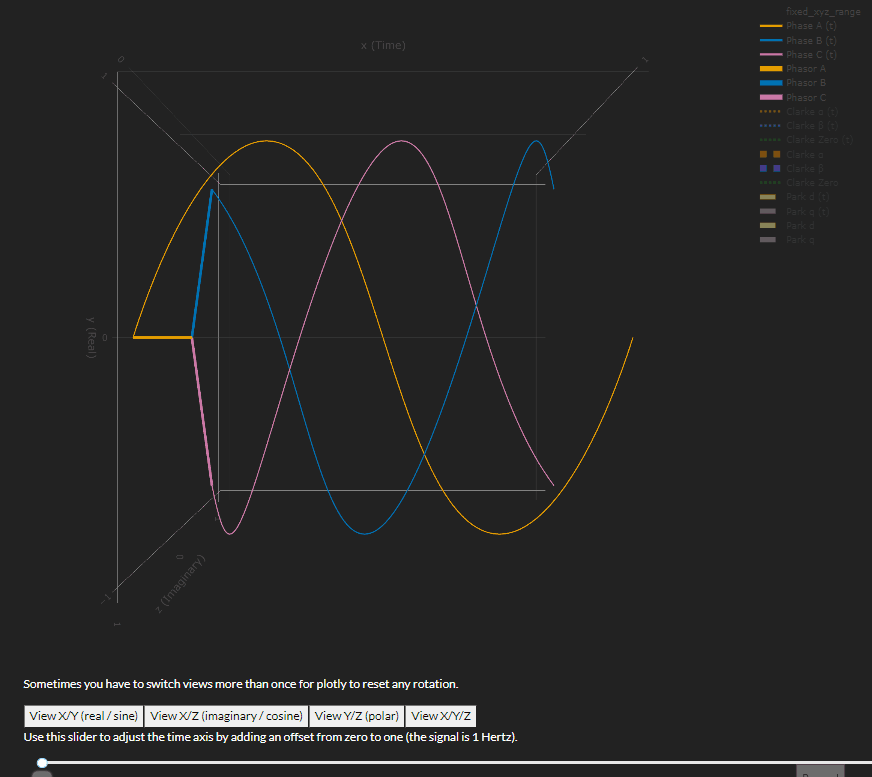
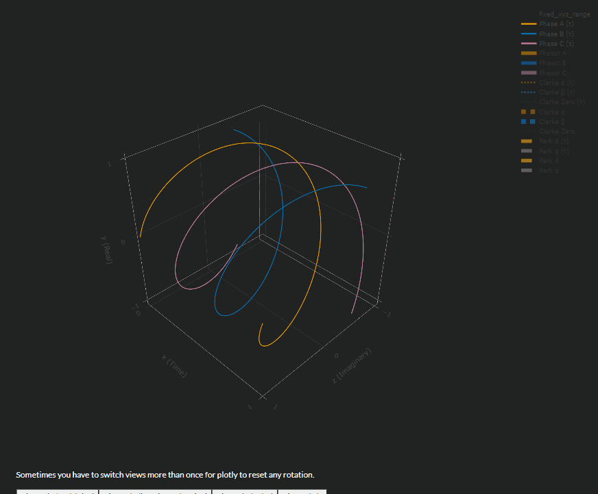

# Introduction #

I'm Exploring Clarke and Park motor control algorithms with interactive scripts. Maybe someone else will find them useful.

## Usage ##

This repository is meant to hold example code for interacting with these equations for demo and educational purposes only. Assuming you have python 3 installed, and the numpy and matplotlib packages installed in your python environment you should be able to run them.

### 2D Version ###

```bash
python clarke_park_2d.py
```

Then open a browser to [http://localhost:8050](http://localhost:8050)



### 3D Version ###

```bash
python clarke_park_3d.py
```

Then open a browser to [http://localhost:8050](http://localhost:8050)

#### View Equations ####

Values in last columns update with plot changes.



#### Interact with Plots ####

Adjust time, individual phase amplitudes, and individual phase offsets using sliders.



#### Change 3D Perspective ####

Change perspectives to one of 4 presets, or manually move camera using the mouse.

