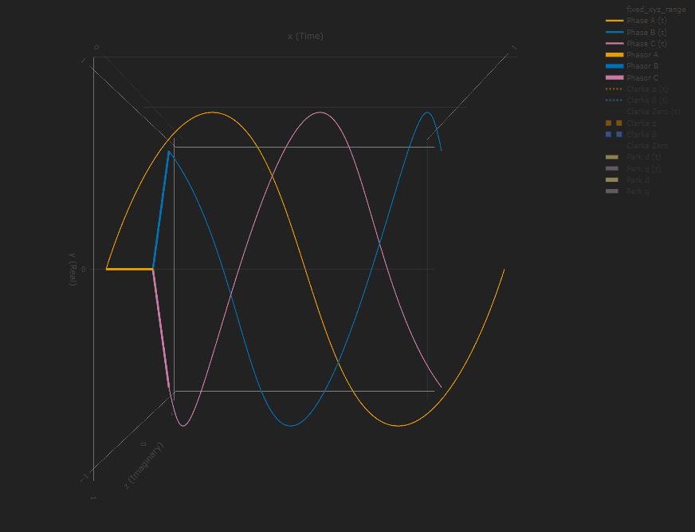
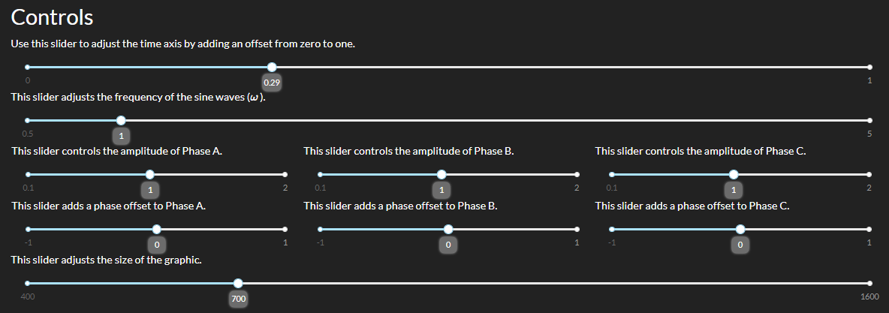

# Introduction #

I'm Exploring Clarke and Park motor control algorithms with interactive scripts. Maybe someone else will find them useful.

## Usage ##

This repository is meant to hold example code for interacting with these equations for demo and educational purposes only. Assuming you have python 3 installed, and the numpy and matplotlib packages installed in your python environment you should be able to run them.

### View Plots ###

#### Get Started ####

1. Install requirements

    ```bash
    python -m pip install -r requirements.txt
    ```

1. Run python3 script

    ```bash
    python clarke_park_3d.py
    ```

1. Open a browser to http://localhost:8050

#### View Equations ####

Values in last columns update with plot changes.


#### Change 3D Perspective ####

Change perspectives to one of 4 presets, or manually move camera using the mouse.


#### Interact with Plots ####

Adjust time, individual phase amplitudes, and individual phase offsets using sliders.




